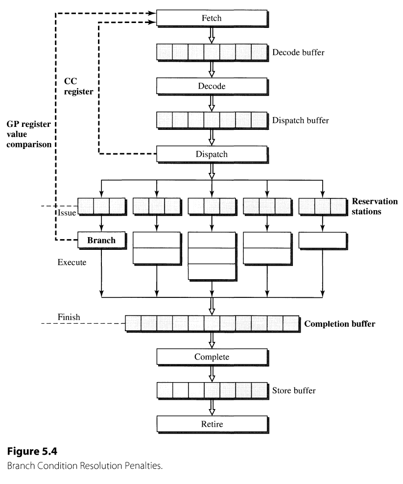

Chapter 5. Superscalar Techniques

- 3 component flows of instructions and/or data (similar to  Superscalar Microprocessor Design [Johnson, 1991])--roughly correspond to the processing of three major types of instructions
  - instruction flow--branch
  - register data flow--ALU
  - memory data flow--load/store

## 1. Instruction Flow Techniques
- deal with the early stages, e.g., fetch, decode
- the primary goal for all instruction flow techniques
  -  maximize the supply of instructions to the superscalar pipeline

### Program Control Flow and Control Dependences
### Performance Degradation Due to Branches
- addressing mode v.s. penalty (distance between the stages of fetch and where branch targets are generated) 
  - unconditional : only the penalty due to target address generation is of concern
    - PC-relative: Decode-1 cyle
    - Register indirect: Dispatch-2
    - Register indirect with offset: execute-3
  
  - conditional branches: branch condition resolution latency must also be considered--condition resolution v.s. penalty
    - condition code registers: assume the code can be accessed in the dispatch stage--2 cycles
    - branch condition can be generated from the comparison between general-purpose registers in execute stage--3

- conclusion
  -  The primary aim of instruction flow techniques is to minimize the number of such fetch stall cycles and/or to make use of these cycles to do potentially useful work
  -  solution: branch prediction
## 2. Register Data Flow Techniques
## 3. Memory Data Flow Techniques
## 4. Summary