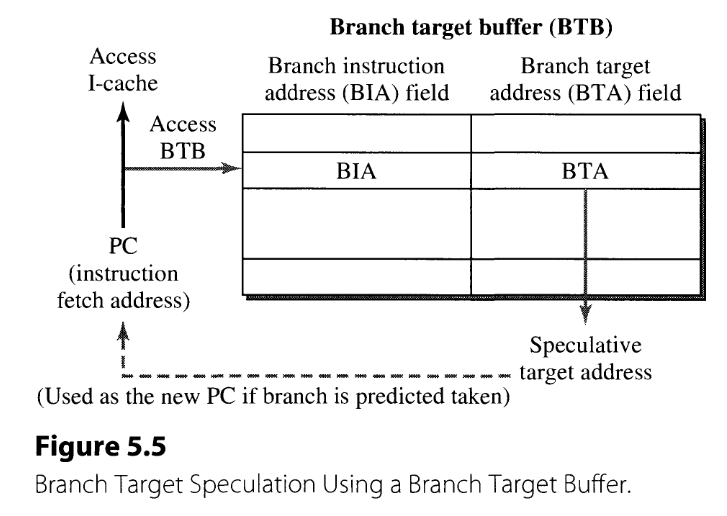
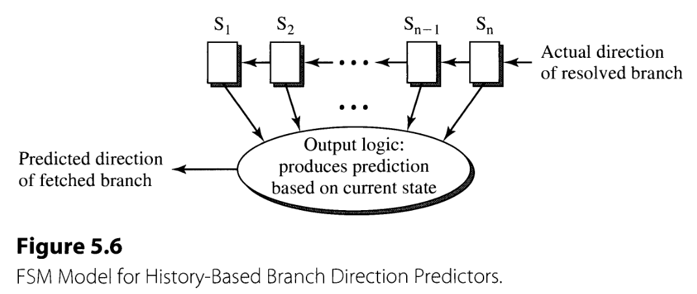
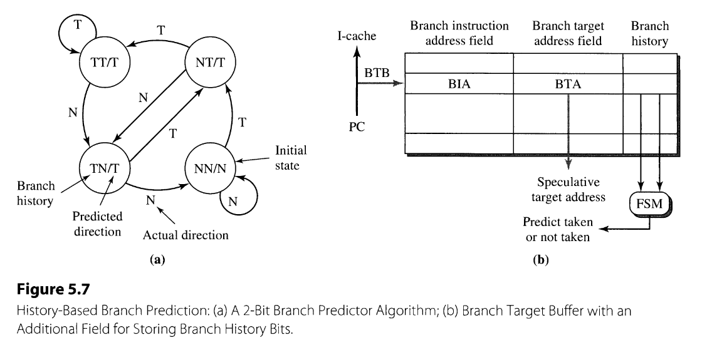
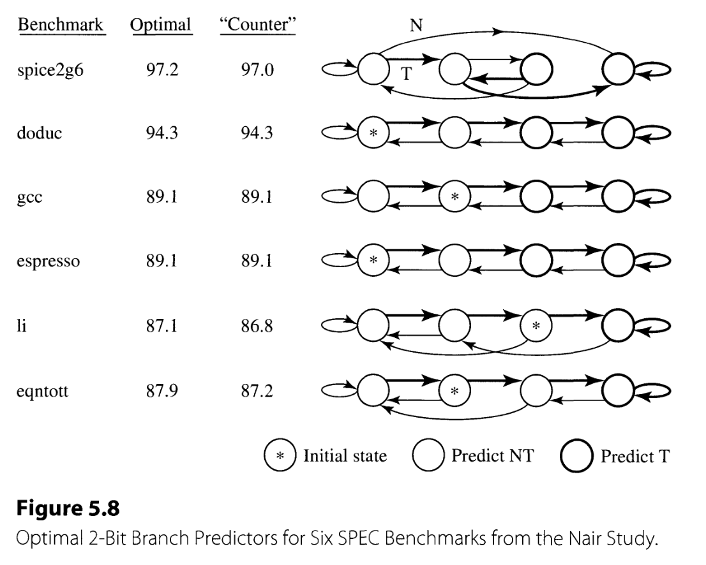

Chapter 5. Superscalar Techniques

- 3 component flows of instructions and/or data (similar to  Superscalar Microprocessor Design [Johnson, 1991])--roughly correspond to the processing of three major types of instructions
  - instruction flow--branch
  - register data flow--ALU
  - memory data flow--load/store

## 1. Instruction Flow Techniques
- deal with the early stages, e.g., fetch, decode
- the primary goal for all instruction flow techniques
  -  maximize the supply of instructions to the superscalar pipeline

### 1.1. Program Control Flow and Control Dependences
### 1.2. Performance Degradation Due to Branches
- addressing mode v.s. penalty (distance between the stages of fetch and where branch targets are generated) 
  - unconditional : only the penalty due to target address generation is of concern
    - PC-relative: Decode-1 cyle
    - Register indirect: Dispatch-2
    - Register indirect with offset: execute-3
  
  - conditional branches: branch condition resolution latency must also be considered--condition resolution v.s. penalty
    - condition code registers: assume the code can be accessed in the dispatch stage--2 cycles
    - branch condition can be generated from the comparison between general-purpose registers in execute stage--3

- conclusion
  -  The primary aim of instruction flow techniques is to minimize the number of such fetch stall cycles and/or to make use of these cycles to do potentially useful work
  -  solution: branch prediction

### 1.3. Branch Prediction Techniques

- predictable v.s. speculation
  - branch target speculation
  - branch condition speculation

- branch target speculation: based on BTB
    
  - BTB: branch target buffer
    - BIA: branch instruction address
    - BTA: branch target address
  - strategies to do branch Prediction
    - always not taken fetching without stalling
      - easy to implement but not effective enough: most branch instructions are taken until exiting loop(jump to the beginning of a functional section, except finally finished current loop)
    - ISA changes and hardware support
      - an extra bit is added to branch instruction format to indicate whether branch is taken or not, which is set by compiler
      - static bit cannot always be valid in all kinds of dynamic execution
      - e.g.: ***Motorola 88110[Diefendorf and Allen, 1992]***
    - branch offset-based techniques: make prediction based on the branch target address offset
      - mechanism: positive offset--not taken; negtive offset--taken
      - e.g.: ***IBM RS/6000 design and so on [Grohoski, 1990; Oehler and Groves, 1990]***
    - history-based prediction speculation: the most common speculation tech. in the contemporary machine
      - FSM(finite state machine) model
        
      - algorithm
         
        - As long as at least one of the two previous executions was a taken branch, it will predict the next execution to be taken. The prediction will only be switched to not taken when it has encountered two consecutive N’s in a row.
      - implementation: augmented BTB
      - accuracy study v.s. specific BHT design
        -  Lee and Smith[1984],  (IBM 370, DEC PDP-11, and CDC 6400)
           - 3:2-taken: not taken
           - history bits v.s. accuracy
         - at IBM by Ravi Nair using the RS/6000 architecture and Systems Performance Evaluation Cooperative (SPEC) benchmarks [Nair, 1992].
           - 2-bit counter algorithm v.s. accuracy
            
           - the effectiveness of counter-based predictors
             - 1-bit: 82.5% to 96.2%. 
             - 2-bit: 86.8% to 97.0%.
             - 3-bit: 88.3% to 97.0%.

### 1.4. Branch Misprediction Recovery
## 2. Register Data Flow Techniques
## 3. Memory Data Flow Techniques
## 4. Summaryrios_pxk